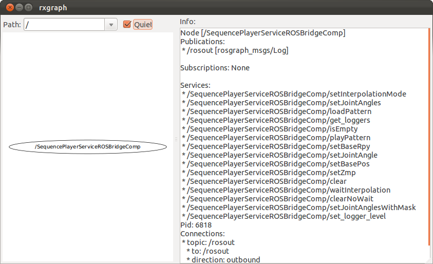
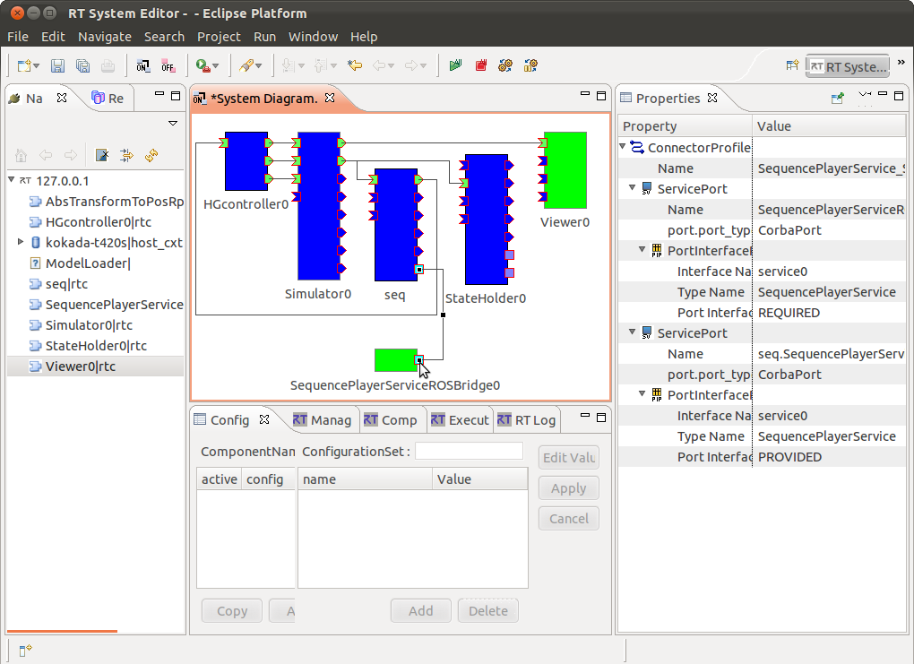

hrpsys ROS Launch Files
=======================

**Description:** hrpsys

  
  
      Basic RT components and utilities to control robots using OpenRTM
  
    

**License:** EPL

hrp4c-rosbridge.launch
----------------------

.. code-block:: bash

  roslaunch hrpsys hrp4c-rosbridge.launch

This is sample launch file for auto-generated ROS bridge for hrp4c simulatoin. Before launch this file please launch hrp4c.launch file

SequencePlayerServiceROSBridgeComp provides following services

.. code-block:: bash

  $ rosservice list
  /SequencePlayerServiceROSBridgeComp/clear
  /SequencePlayerServiceROSBridgeComp/clearNoWait
  /SequencePlayerServiceROSBridgeComp/get_loggers
  /SequencePlayerServiceROSBridgeComp/isEmpty
  /SequencePlayerServiceROSBridgeComp/loadPattern
  /SequencePlayerServiceROSBridgeComp/playPattern
  /SequencePlayerServiceROSBridgeComp/setBasePos
  /SequencePlayerServiceROSBridgeComp/setBaseRpy
  /SequencePlayerServiceROSBridgeComp/setInterpolationMode
  /SequencePlayerServiceROSBridgeComp/setJointAngle
  /SequencePlayerServiceROSBridgeComp/setJointAngles
  /SequencePlayerServiceROSBridgeComp/setJointAnglesWithMask
  /SequencePlayerServiceROSBridgeComp/setZmp
  /SequencePlayerServiceROSBridgeComp/set_logger_level
  /SequencePlayerServiceROSBridgeComp/waitInterpolation

from hrpsys/idl/SequencePlayerService.idl file

.. code-block:: bash
  
  module OpenHRP
  {
    interface SequencePlayerService
    {
      void waitInterpolation();
      boolean setJointAngles(in dSequence jvs, in double tm);
      boolean setJointAnglesWithMask(in dSequence jvs, in bSequence mask,
  				   in double tm);
      boolean setJointAngle(in string jname, in double jv, in double tm);
      boolean setBasePos(in dSequence pos, in double tm);
      boolean setBaseRpy(in dSequence rpy, in double tm);
      boolean setZmp(in dSequence zmp, in double tm);
      boolean isEmpty();
      void loadPattern(in string basename, in double tm);
      void playPattern(in dSequenceSequence pos, 
  		     in dSequenceSequence rpy,
  		     in dSequenceSequence zmp, 
  		     in dSequence tm);
      void clear();
      void clearNoWait();
      boolean setInterpolationMode(in interpolationMode i_mode_);
    };
  };
  
  

Contents
########

.. code-block:: xml

  <launch>
    
    <arg default="localhost" name="nameserver" />
    <env name="RTCTREE_NAMESERVERS" value="$(arg nameserver)" />
    <arg name="openrtm_args" value="-o &quot;corba.nameservers:$(arg nameserver):2809&quot; -o &quot;naming.formats:%n.rtc&quot; -o &quot;logger.file_name:/tmp/rtc%p.log&quot; " />
    
  
    
    <node args="$(arg openrtm_args)" name="SequencePlayerServiceROSBridgeComp" pkg="hrpsys" type="SequencePlayerServiceROSBridgeComp">
      <param name="service_port" value="service0" />
    </node>
  
    
    <node args="$(find hrpsys)/samples/hrp4c-rosbridge.launch" name="rtmlaunch_rosbridge" pkg="openrtm" type="rtmlaunch.py" />
    <rtactivate component="SequencePlayerServiceROSBridge0.rtc" />
    <rtconnect from="SequencePlayerServiceROSBridge0.rtc:SequencePlayerService" to="seq.rtc:SequencePlayerService" />
    
  
    </launch>

_gen_project.launch
-------------------

.. code-block:: bash

  roslaunch hrpsys _gen_project.launch

hrp4c.launch
------------

.. code-block:: bash

  roslaunch hrpsys hrp4c.launch

This scripts starts HRP-4C.xml hrpsys-base sample project file. First, 
select StartSimulation sub-menu from GrxUI menu, or clock Simulation Start button to start simulation, then execute `HRP4C.py` program as followings to make the robot walk.

.. code-block:: bash

  rosrun hrpsys hrpsyspy `rospack find hrpsys`/share/hrpsys/samples/HRP-4C/HRP4C.py

.. video:: build/images/HRP4C
  :width: 600

  

Contents
########

.. code-block:: xml

  <launch>
    <include file="$(find hrpsys)/launch/hrpsys.launch">
      <arg name="PROJECT_FILE" value="$(find hrpsys)/share/hrpsys/samples/HRP-4C/HRP-4C.xml" />
      <arg name="MODEL_FILE" value="$(find hrpsys)/share/hrpsys/samples/HRP-4C/HRP4Cmain.wrl" />
      <arg name="CONF_FILE" value="$(find hrpsys)/share/hrpsys/samples/HRP-4C/HRP-4C.conf" />
      <arg name="SIMULATOR_NAME" value="HRP-4C(Robot)0" />
    </include>
  
    
    <node args="$(find hrpsys)/share/hrpsys/samples/HRP-4C/HRP4Cmain.wrl $(find hrpsys)/launch/hrp4c.launch" name="rtmlaunch_hrp4c" pkg="hrpsys" type="hrpsys-launch.sh" />
    <rtconnect from="HRP-4C(Robot)0.rtc:state" to="Viewer0.rtc:state" />
    
  
    <test args="--max-time=100   --viewer-name='' #   --no-start-simulation   --capture-window='Irrlicht'   --target-directory=$(find hrpsys)/build/images   --script='$(find hrpsys)/scripts/hrp4c_walk.sh'" pkg="openhrp3" test-name="HRP4C" time-limit="300" type="test-grxui.py" />
    <test args="$(find hrpsys)/build/images/HRP4C.ogv" pkg="jsk_tools" test-name="z_HRP4C" time-limit="1000" type="ogv_encode.sh" />
  </launch>

hrpsys-grxui.launch
-------------------

.. code-block:: bash

  roslaunch hrpsys hrpsys-grxui.launch

hrpsys.launch
-------------

.. code-block:: bash

  roslaunch hrpsys hrpsys.launch

pa10.launch
-----------

.. code-block:: bash

  roslaunch hrpsys pa10.launch

This scripts starts PA10.xml hrpsys-base sample project file, First, select StartSimulation sub-menu from GrxUI menu, or clock simulation start button. Then, the robot picks up the green box from the ground by executing following program

.. code-block:: bash

  rosrun hrpsys hrpsyspy `rospack find hrpsys`/share/hrpsys/samples/PA10/PA10.py

.. video:: build/images/PA10
  :width: 600

  

Contents
########

.. code-block:: xml

  <launch>
    <env name="LANG" value="C" />
    <arg name="MODEL_FILE" value="$(find hrpsys)/share/hrpsys/samples/PA10/PA10.xml" />
  
    <node name="rtm_naming" pkg="openrtm" type="rtm-naming-restart" />
    <node name="hrpsys_kill_all" pkg="openhrp3" type="openhrp-shutdown-servers" />
    <node args="$(arg MODEL_FILE)" name="grxui" pkg="openhrp3" type="grxui.sh" />
    <node cwd="node" name="hrpsys" pkg="hrpsys" type="hrpsys.sh" />
  
    <test args="--start-simulation --max-time=10   --target-directory=$(find hrpsys)/build/images   --script='rosrun hrpsys hrpsyspy $(find hrpsys)/share/hrpsys/samples/PA10/PA10.py'" pkg="openhrp3" test-name="PA10" time-limit="300" type="test-grxui.py" />
    <test args="$(find hrpsys)/build/images/PA10.ogv" pkg="jsk_tools" test-name="z_PA10" time-limit="1000" type="ogv_encode.sh" />
  </launch>

samplerobot.launch
------------------

.. code-block:: bash

  roslaunch hrpsys samplerobot.launch

This launch file shows an example of create project file for the robot

`roslaunch hrpsys samplerobot.launch` starts SampleRobot_inHouse.xml project file, this project file invokes `openhrp-controller-bridge.sh` that reads project file and create openhrp3 simulator and rtc ontroller bridge RTC named `SampleRobot(Robot)`

.. code-block:: bash

  rosrun hrpsys hrpsyspy `rospack find hrpsys`/scripts/hrpsys.py `rospack find hrpsys`/scripts/SampleRobot_inHouse.xml

Then type `rosrun hrpsys hrpsyspy hrpsys.py <project xml file>` to start SequencePlayer(seq) and StateHolder(sh) , and serialize theses components includes the bridge component

.. code-block:: bash

  rosrun hrpsys SampleRobot_walk.sh

Finally, `rosrun hrpsys SampleRobot_walk.sh` read walking pattern data and send to `seq` component.

.. video:: build/images/SampleRobot
  :width: 600

  

Contents
########

.. code-block:: xml

  <launch>
    <env name="LANG" value="C" />
    <arg name="MODEL_FILE" value="$(find hrpsys)/scripts/SampleRobot_inHouse.xml" />
  
    <node name="rtm_naming" pkg="openrtm" type="rtm-naming-restart" />
    <node name="hrpsys_kill_all" pkg="openhrp3" type="openhrp-shutdown-servers" />
    <node args="$(arg MODEL_FILE)" name="grxui" pkg="openhrp3" type="grxui.sh" />
  
    <test args="--start-simulation --max-time=300   --target-directory=$(find hrpsys)/build/images   --script='sleep 5; rosrun hrpsys hrpsyspy $(find hrpsys)/scripts/hrpsys.py $(find hrpsys)/scripts/SampleRobot_inHouse.xml; rosrun hrpsys SampleRobot_walk.sh'" pkg="openhrp3" test-name="SampleRobot" time-limit="600" type="test-grxui.py" />
    <test args="$(find hrpsys)/build/images/SampleRobot.ogv" pkg="jsk_tools" test-name="z_SampleRobot" time-limit="1000" type="ogv_encode.sh" />
  </launch>

