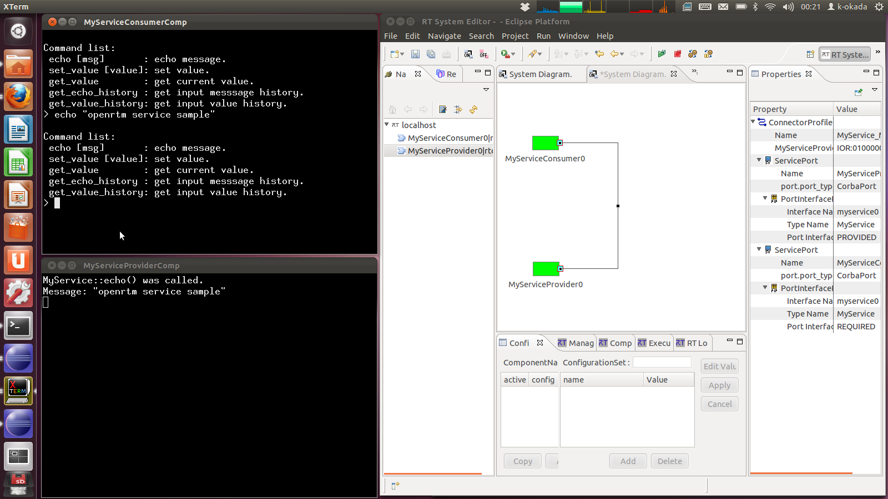
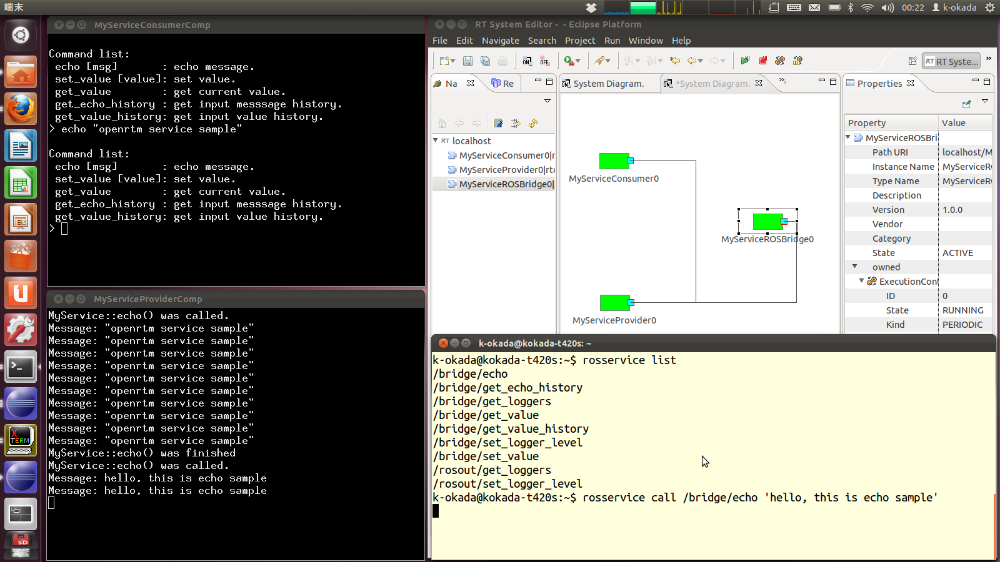
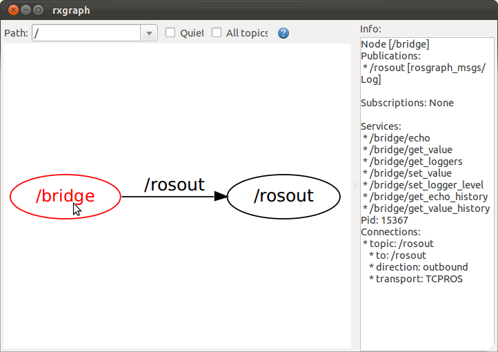

openrtm_ros_bridge ROS Launch Files
===================================

**Description:** openrtm_ros_bridge

  
  
       openrtm_ros_bridge
  
    

**License:** BSD

myservice_example.launch
------------------------

.. code-block:: bash

  roslaunch openrtm_ros_bridge myservice_example.launch

sample programs for OpenRTM service port connection

  

Contents
########

.. code-block:: xml

  <launch>
    
    <arg default="localhost" name="nameserver" />
    <env name="RTCTREE_NAMESERVERS" value="$(arg nameserver)" />
    <arg name="openrtm_args" value="-o &quot;corba.nameservers:$(arg nameserver):2809&quot; -o &quot;naming.formats:%n.rtc&quot; -o &quot;logger.file_name:/tmp/rtc%p.log&quot; " />
    
  
    <node name="rtm_naming" pkg="openrtm" type="rtm-naming-restart" />
    <node name="rtsysedit" pkg="openhrp3" type="rtsysedit.sh" />
  
    
    <node args="$(arg openrtm_args)" launch-prefix="xterm -fn 10x20 -geometry 60x20 -e" name="provider" pkg="openrtm" type="MyServiceProviderComp" />
  
    
    <node args="$(arg openrtm_args)" launch-prefix="xterm -fn 10x20 -geometry 60x20 -e" name="consumer" pkg="openrtm" type="MyServiceConsumerComp" />
  
  
    
    <node args="$(find openrtm_ros_bridge)/samples/myservice_example.launch" name="rtmlaunch_example" pkg="openrtm" type="rtmlaunch.py" />
    <rtactivate component="MyServiceProvider0.rtc" />
    <rtactivate component="MyServiceConsumer0.rtc" />
    <rtconnect from="MyServiceProvider0.rtc:MyService" to="MyServiceConsumer0.rtc:MyService" />
    
  
    </launch>

myservice_rosbridge.launch
--------------------------

.. code-block:: bash

  roslaunch openrtm_ros_bridge myservice_rosbridge.launch

This is sample launch file for auto-generated ROS bridge for SimpleService in OpenRTM/samples.

MyServiceROSBridgeComp provides fowllonwg ros service

.. code-block:: bash

  $ rosservice  list
  /bridge/echo
  /bridge/get_echo_history
  /bridge/get_loggers
  /bridge/get_value
  /bridge/get_value_history
  /bridge/set_logger_level
  /bridge/set_value

from following IDL file

.. code-block:: bash

  module SimpleService {
  typedef sequence<string> EchoList;
  typedef sequence<float> ValueList;
  interface MyService
  {
    string echo(in string msg);
    EchoList get_echo_history();
    void set_value(in float value);
    float get_value();
    ValueList get_value_history();
  };
  };

Now you can call OpenRTM service in MyServiceProviderComp from following ros command

.. code-block:: bash

 rosservice call /bridge/echo "hello , this is echo sample"

  

Contents
########

.. code-block:: xml

  <launch>
    
    <arg default="localhost" name="nameserver" />
    <env name="RTCTREE_NAMESERVERS" value="$(arg nameserver)" />
    <arg name="openrtm_args" value="-o &quot;corba.nameservers:$(arg nameserver):2809&quot; -o &quot;naming.formats:%n.rtc&quot; -o &quot;logger.file_name:/tmp/rtc%p.log&quot; " />
    
  
    
    <node args="$(arg openrtm_args)" name="bridge" pkg="openrtm_ros_bridge" type="MyServiceROSBridgeComp">
      <param name="service_port" value="myservice0" />
    </node>
  
    
    <node args="$(find openrtm_ros_bridge)/samples/myservice_rosbridge.launch" name="rtmlaunch_rosbridge" pkg="openrtm" type="rtmlaunch.py" />
    <rtactivate component="MyServiceROSBridge0.rtc" />
    <rtconnect from="MyServiceProvider0.rtc:MyService" to="MyServiceROSBridge0.rtc:MyService" />
    
  
    </launch>

test_myservice_rosbridge.launch
-------------------------------

.. code-block:: bash

  roslaunch openrtm_ros_bridge test_myservice_rosbridge.launch

