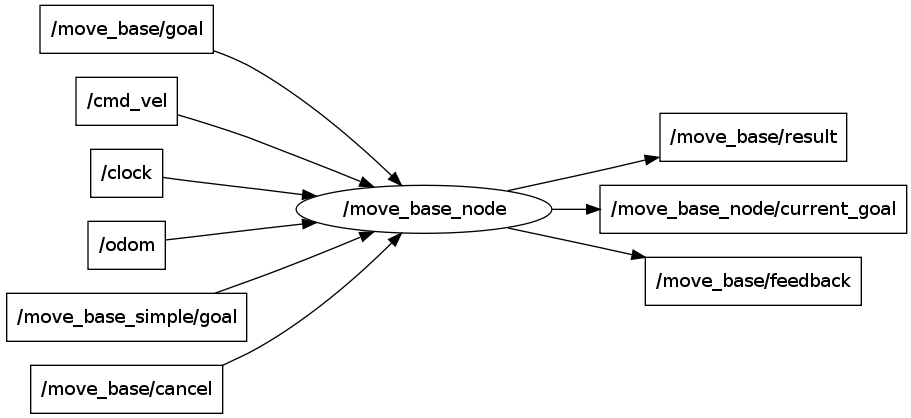
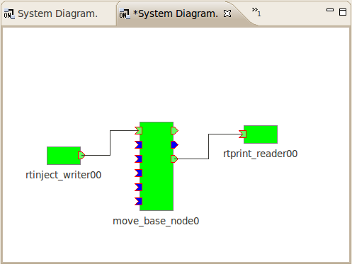
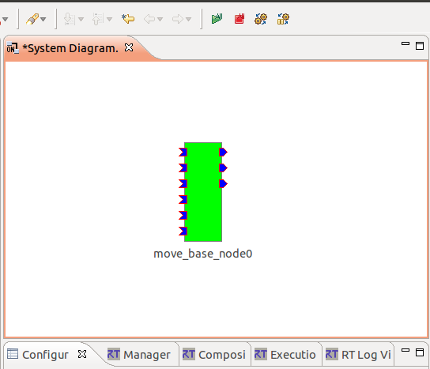
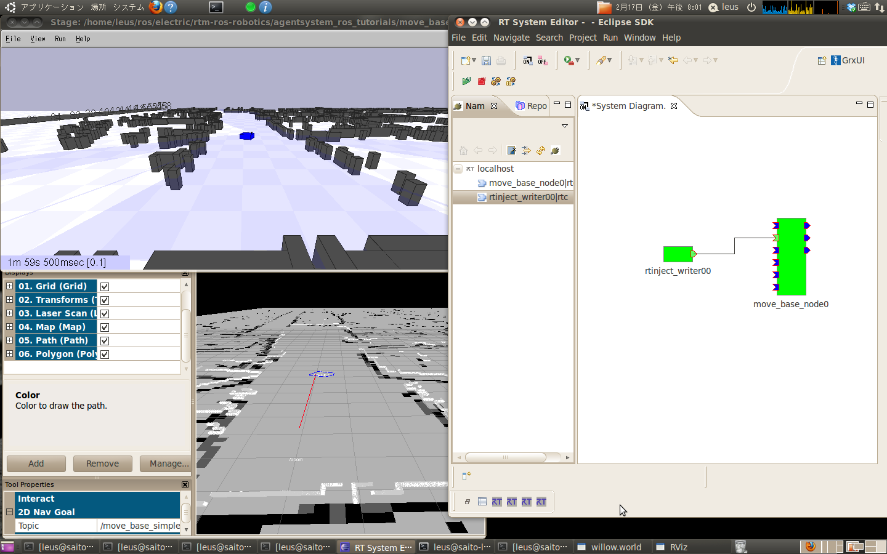
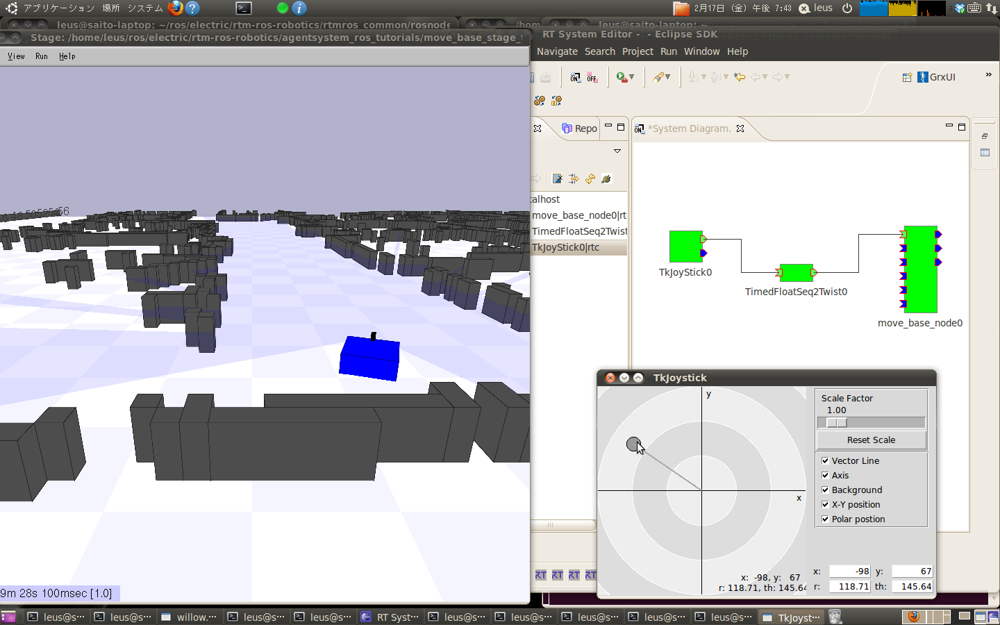

rosnode_rtc ROS Launch Files
============================

**Description:** rosnode_rtc

  
  
       rosnode_rtc
  
       This package gives transparency between RTM and ROS.
  
       rtmros-data-bridge.py is a RT-Component for dataport/topic.
       This automatically convert ROS/topic into RTM/dataport.
  
    

**License:** BSD

chatter_inport.launch
---------------------

.. code-block:: bash

  roslaunch rosnode_rtc chatter_inport.launch

chatter_inport_1.1.0.launch
---------------------------

.. code-block:: bash

  roslaunch rosnode_rtc chatter_inport_1.1.0.launch

chatter_outport.launch
----------------------

.. code-block:: bash

  roslaunch rosnode_rtc chatter_outport.launch

stage_sample.launch
-------------------

.. code-block:: bash

  roslaunch rosnode_rtc stage_sample.launch

ROSのノードが送受信するトピックをRTMのデータポートとしての利用を実現するRTコンポーネントです。

上記の図の様に本RTCのデータポートがROSトピックと１対１対応します。

To use this RTC, run the below command each bash terminal.

  source \`rospack find openrtm\`/scripts/rtshell-setup.sh

Usage:

1. roslaunch move_base_stage_tutorial robot.launch

   (rosrun rviz rviz -d \`rospack find move_base_stage_tutorial\`/config/rviz.vcg )

2. roslaunch rosnode_rtc stage_sample.launch

Launch this configuration file and confirm the bridge node is Activated

3a. rosrun rosnode_rtc stage_sample_send_goal.sh

Send navigation target pose to /move_base_simple/goal topic from RT-Component
台車が動けば成功です。

目的地に到達するとxtermの画面にROSの動作経過トピックがrtprintで表示されます。

3b. TkJoyStickコンポーネントを使う(http://www.openrtm.org/openrtm/ja/node/819)
・rosnode_rtc/samples内のTimedFloatSeq2Twist.pyを実行します。
これが実質的なデータの変換（単位、符号など）を行う部分になっています。
・TkJoyStickを実行します。
roscd openrtm/build/OpenRTM-aist-Python-1.0.1/OpenRTM_aist/examples/TkJoyStickで移動して、python TkJoyStickComp.py

TkJoyStick0:posとTimedFloatSeq2Twist0:in、
TimedFloatSeq2Twist0:outとmove_base_node0.rtc:cmd_velをつないでから、
３つのコンポーネント全てをActivateします。
台車が動けば成功です。

<仕様メモ>
wrap_nodeでノード名を指定した場合には全てのトピックをデータポート化します。
この場合にはinput_topicとoutput_topicで指定したトピックが優先されます。

可変長のデータを含むメッセージ型を無視するように設定されています。
全てのトピックを出したいときはignore_unboundパラメタでFalseに指定する。

また、InPortとOutPortで同じ名前を指定できないため、
ROSノードが送受信をする場合には対応するOutPortを作りません。

  

Contents
########

.. code-block:: xml

  <launch>
  
    
    <env name="PYTHONPATH" value="$(env PYTHONPATH)" />
    <node name="rtm_naming" pkg="openrtm" type="rtm-naming-restart" />
  
    
    <node clear_params="true" cwd="node" name="bridge" output="screen" pkg="rosnode_rtc" type="rtmros-data-bridge.py">
      <param name="~output_topic" value="/cmd_vel" />
      <param name="~wrap_node" value="/move_base_node" />
      <param name="~ignore_unbound" value="True" />
    </node>
  
    
    <node args="/localhost/move_base_node0.rtc:move_base_feedback" launch-prefix="xterm -e" name="rtprint" pkg="rosnode_rtc" type="dataport_rtprint.sh" />
  
    
    <node args="$(find rosnode_rtc)/sample/stage_sample.launch" name="rtmlaunch_data_bridge" pkg="openrtm" type="rtmlaunch.py" />
    <rtactivate component="move_base_node0.rtc" />
    
  
    </launch>

tkjoy_sample.launch
-------------------

.. code-block:: bash

  roslaunch rosnode_rtc tkjoy_sample.launch

  

Contents
########

.. code-block:: xml

  <launch>
  
    
    <env name="PYTHONPATH" value="$(env PYTHONPATH):$(find openrtm)/lib/python2.7/site-packages/OpenRTM_aist/RTM_IDL/" />
  
    
    <node cwd="node" name="timedfloatseq2twist" output="screen" pkg="rosnode_rtc" type="TimedFloatSeq2Twist.py" />
    <node name="tkjoy" output="screen" pkg="rosnode_rtc" type="tkjoy_comp.sh" />
  
    
    <node args="$(find rosnode_rtc)/sample/tkjoy_sample.launch" name="tkjoy_sample_launch" pkg="openrtm" type="rtmlaunch.py" />
    <rtactivate component="TimedFloatSeq2Twist0.rtc" />
    <rtactivate component="TkJoyStick0.rtc" />
    <rtconnect from="TkJoyStick0.rtc:pos" to="TimedFloatSeq2Twist0.rtc:in" />
    <rtconnect from="TimedFloatSeq2Twist0.rtc:out" to="move_base_node0.rtc:cmd_vel" />
    
  
    </launch>

